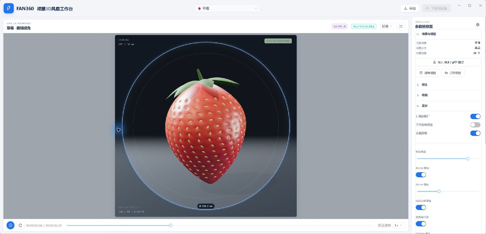
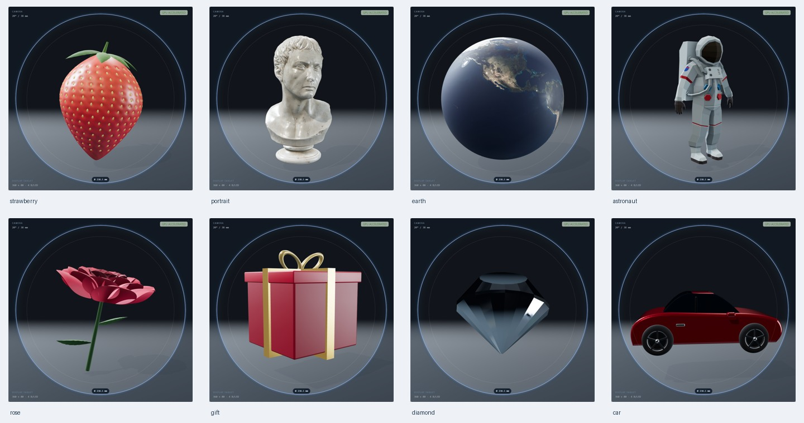

# Fan360 Studio

裸眼 3D 旋转风扇动画配置桌面应用，使用 Electron、React、Ant Design 和 Three.js。



## 运行与验证

在 Windows 上使用 Node.js 22.12 或更新版本，进入仓库根目录：

```powershell
npm install
npm run dev
```

```powershell
npm run typecheck
npm test
npm run test:render
```

`test:render` 会构建应用、启动独立 Electron 测试实例，并在离线环境检查 20 个场景的屏幕画面、动画变化、360×80 设备采样帧、暂停/继续、显示开关和右栏恢复。它还会在四种窗口尺寸下检查滚动条拖动、下方内容完整显示、圆盘图像及画布尺寸同步，包含最小窗口和 150% 缩放。截图和报告保存在不提交的 `test-artifacts/render-built/` 目录。

## 工作台

- 默认窗口为 2080×1000；超过显示器工作区时自动适配。顶部高度为 72 px。
- 顶部只保留 LOGO/名称、场景选择、导出和“下载到设备”。
- 右侧“显示”设置提供参数栏、下方设备预览和设备圆框三个开关。参数栏收起后，通过右边缘的设置按钮恢复。
- 显示下方设备预览时，可拖动主区域右边缘的滚动条查看完整圆盘和链路数据。窗口宽度不足 1600 px 时，两张卡片上下排列；标题栏和右侧参数栏保持独立。
- “场景与模型”提供项目保存/打开和本地 GLB、glTF 多文件导入；“动画”提供录制。
- 20 个场景共享本地摄影棚环境光、物理材质和色调映射。草莓、玫瑰、礼盒、钻石和跑车使用细化的程序化模型；人物雕像采用扫描资产，宇航员采用完整 GLB，地球采用地表贴图。
- 编辑器中的舞台不进入设备输出，设备帧以黑底采样场景主体。字体、模型、贴图、环境光和 Draco 解码器均随应用本地打包。



写实程度仍取决于场景资产：扫描雕像具有真实表面细节，程序化角色及抽象特效仍属于设计素材。可以导入带 PBR 贴图的高精度 GLB/glTF 模型来呈现具体商品或人物。

## 设备与文件

- 手动输入设备 IP，TCP 端口固定为 5000。
- 参数基线：1000 rpm、360 个角度片、80 个径向 LED、4 B/LED。
- 同步时暂停刷新，整帧传输并校验后恢复显示。
- 支持 `.fanproj` 项目、单帧/动画 `.fan360` 导出，以及多帧 TCP 同步。

桌面渲染和协议测试不能替代真实风扇上的显示、时序及通信验证。单页旋转风扇呈现的是平面光场上的立体视觉错觉。

## Windows 构建

```powershell
npm run build
npm run package
```

安装器和免安装程序位于 `apps/desktop/release/`。源码仓库不包含依赖目录、构建产物和安装包。

## 文档与许可

- [本次修改与验证](docs/verification-2026-09-20.md)
- [技术方案](docs/technical-design.md)
- [设备协议](docs/tcp-protocol.md)
- [开发任务清单](docs/development-plan.md)
- [第三方资产来源与许可](apps/desktop/src/renderer/public/ASSET-CREDITS.md)

项目源码采用仓库的 MIT 许可证。第三方模型、纹理和解码器遵循各自列出的许可。
